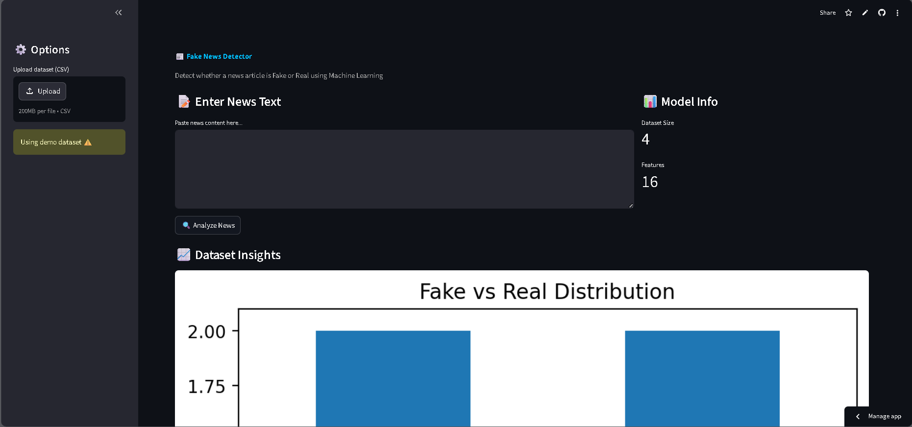
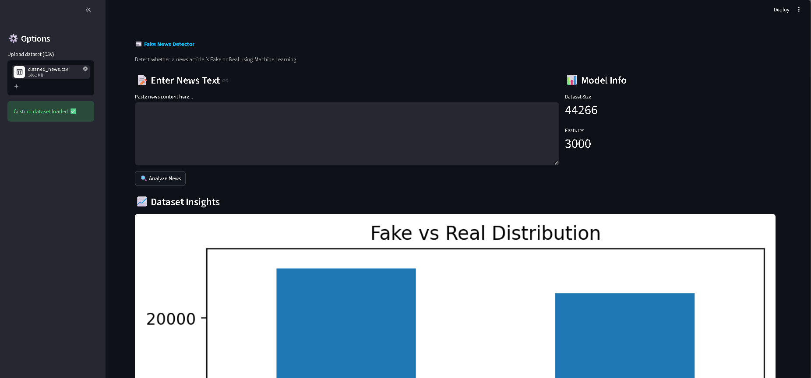
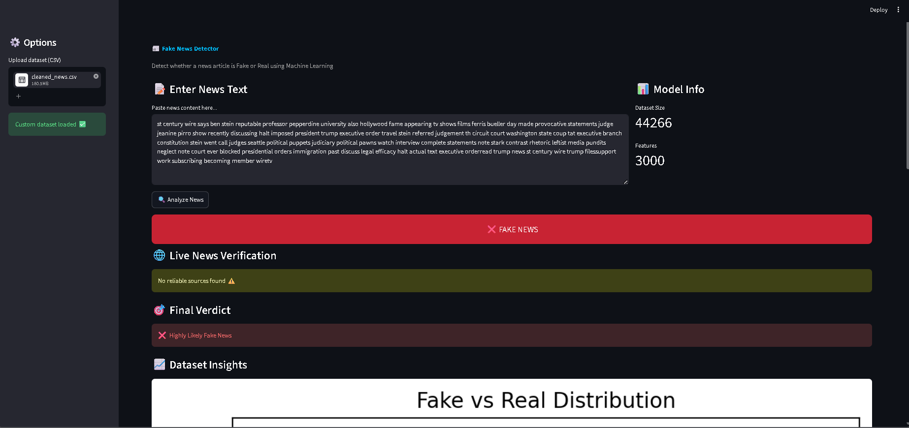

# 📰 Fake News Detector (ML + Real-Time API Verification)

An intelligent web application that detects whether a news article is Real or Fake using Machine Learning and enhances reliability with real-time news verification via API.

<p align="center">
  <b>AI-powered Fake News Detection using Machine Learning + Real-Time Verification</b><br>
  <i>Built with NLP, TF-IDF, Logistic Regression & News API</i>
</p>

<p align="center">
  
  
  
  
</p>

---

## 🚀 Live Demo

👉 https://fake-news-detector-fefxyybivnmzeudmr28vvk.streamlit.app/

---

## 📸 Screenshots







```id="shots"
assets/
 ├── home.png
 ├── Dataset.png
 └── Result.png
```

<p align="center">
  
  
  
</p>

---

## 🎯 Problem Statement

With the rapid spread of misinformation online, identifying whether a news article is **real or fake** has become increasingly difficult.

This project aims to:

* Detect fake news using machine learning
* Improve reliability using **real-time verification**
* Provide a simple and interactive interface for users

---

## ⚡ Features

* 🔍 Fake vs Real News Detection
* 🌐 Live News Verification using API
* 🧠 Hybrid AI System (ML + External Data)
* 📊 Dataset Visualization
* 📁 Upload Custom Dataset
* ⚡ Fast, Interactive UI (Streamlit)

---

## 🧠 How It Works

### 🔹 Step 1: Text Preprocessing

* Lowercasing
* Removing punctuation
* Stopword removal

### 🔹 Step 2: Feature Extraction

* TF-IDF Vectorization converts text → numerical form

### 🔹 Step 3: Model Training

* Logistic Regression trained on labeled dataset

### 🔹 Step 4: API Verification

* Searches real-time news using external API

### 🔹 Step 5: Final Decision

| ML Result | API Result | Final Verdict     |
| --------- | ---------- | ----------------- |
| Real      | Found      | ✅ Highly Reliable |
| Fake      | Not Found  | ❌ Likely Fake     |
| Mixed     | Partial    | ⚠️ Uncertain      |

---

## 🛠️ Tech Stack

| Category      | Tools Used           |
| ------------- | -------------------- |
| Language      | Python               |
| Frontend      | Streamlit            |
| ML/NLP        | Scikit-learn, TF-IDF |
| Data Handling | Pandas, NumPy        |
| Visualization | Matplotlib           |
| NLP Utils     | NLTK                 |
| API           | Requests             |

---

## 📁 Project Structure

```id="struct"
fake-news-detector/
│
├── app/
│   └── streamlit_app.py
│
├── src/
│   ├── model.py
│   └── preprocessing.py
│
├── data/                 # (ignored in GitHub)
├── assets/               # screenshots
├── .streamlit/
│   └── secrets.toml
│
├── requirements.txt
├── .gitignore
└── README.md
```

---

## 🔐 API Setup

### 1. Get API Key

👉 https://newsapi.org/

### 2. Create file

```id="sec"
.streamlit/secrets.toml
```

### 3. Add key

```toml id="key"
NEWS_API_KEY = "your_api_key_here"
```

⚠️ Do NOT upload this file to GitHub

---

## ⚙️ Installation

```bash id="inst1"
git clone https://github.com/YOUR_USERNAME/fake-news-detector.git
cd fake-news-detector
```

```bash id="inst2"
python -m venv venv
venv\Scripts\activate
```

```bash id="inst3"
pip install -r requirements.txt
```

```bash id="inst4"
streamlit run app/streamlit_app.py
```

---

## 📊 Output

* ✅ Real News Detection
* ❌ Fake News Detection
* 🌐 Related News Links
* 📈 Dataset Visualization

---

## 💡 Key Learnings

* End-to-end ML pipeline building
* Importance of data preprocessing
* Debugging model bias issues
* Real-world API integration
* Deploying ML apps using Streamlit

---

## 🚧 Limitations

* Model depends on dataset quality
* API may not return all relevant news
* Not a 100% fact-checking system

---

## 🚀 Future Improvements

* Add BERT / Transformer models
* Explainable AI (why prediction?)
* Multi-language support
* Better UI/UX

---

## 👩‍💻 Author

**Shrishti Banshiar**
📧 [shrishtibanshiar105@gmail.com](mailto:shrishtibanshiar105@gmail.com)

---

## ⭐ Support

If you like this project, give it a ⭐ on GitHub!

---
